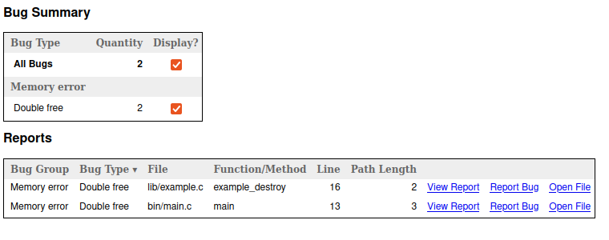
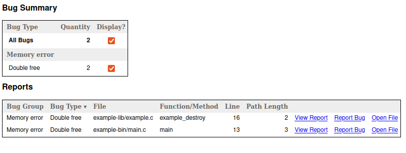

### `scan-build` path computation bug

This repo contains a project which demonstrates a bug in `scan-build`'s path computation.
In order to reproduce the bug, you will need the `scan-build`, `meson`, and `ninja` installed. 
Once they are installed, execute the following in this repo:

```sh
meson setup build
ninja -C build scan-build
```

This should generate a report which can be viewed with `scan-view`. In this report
the paths to the files containing the detected bugs will not be correct:



This is what the paths should look like:


